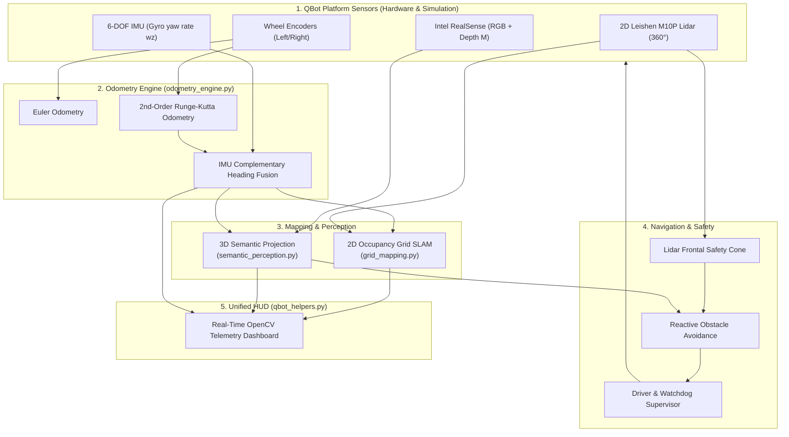

# Metric-Semantic Autonomous Mobile Robot (AMR) on Quanser QBot Platform
## Project Specification, Technical Formulations, and Step-by-Step Checklist

---

## 1. Executive Summary

This project builds a full-stack, industry-grade **Autonomous Mobile Robot (AMR)** pipeline on the **Quanser QBot Platform**, fully compatible with both the **QLabs Digital Twin** and **Physical Lab Hardware**.

### Core Capabilities:
1. **High-Precision Odometry**: 2nd-Order Runge-Kutta dead reckoning + 6-DOF IMU gyroscope heading fusion.
2. **Real-Time 2D Occupancy Grid Mapping**: Log-odds inverse sensor model with Bresenham raycasting from 360° Lidar scans.
3. **RGB-D 3D Semantic Perception**: 2D object detection (YOLOv8) back-projected with depth intrinsics into 3D metric coordinates $(X, Y, Z)$.
4. **Dynamic Obstacle Avoidance**: Dynamic frontal safety cone using Lidar ranges + semantic obstacle stopping, verified in real-time.
5. **Unified OpenCV HUD**: Real-time multi-panel dashboard displaying camera feeds with 3D bounding boxes, live map, and telemetry.

---

## 2. Interactive Step-by-Step Checklist

Use this checklist to track your progress as you build and test each module.

### 📍 Phase 1: Odometry & State Estimation (Current Phase)
- [x] **Task 1.1**: Open [odometry_engine.py](file:///c:/Users/USER/Documents/Robotics/QBot-Odometry/odometry_engine.py) and implement `wrap_to_pi(angle)`.
- [x] **Task 1.2**: Implement `update_pose_euler(delta_sL, delta_sR)` (1st-order forward integration).
- [x] **Task 1.3**: Implement `update_pose_rk2(delta_sL, delta_sR)` (2nd-order midpoint integration).
- [x] **Task 1.4**: Implement `fuse_heading_complementary(...)` (IMU Gyro $\omega_z$ + Encoder blending).
- [x] **Task 1.5**: Run `python test_odometry.py` in simulation to verify the $1.0\text{m} \times 1.0\text{m}$ square maneuver.
- [ ] **Task 1.6**: Inspect loop closure errors and verify generated plot `docs/figures/odometry_benchmark.png`.
- [ ] **Task 1.7 (Lab)**: Deploy and run `test_odometry.py` on the physical QBot.

---

### 📍 Phase 2: 2D Occupancy Grid Mapping (Lidar SLAM)
- [ ] **Task 2.1**: Implement `bresenham_line(x0, y0, x1, y1)` for fast grid raycasting.
- [ ] **Task 2.2**: Implement `inverse_sensor_model(...)` (log-odds update for free and occupied cells).
- [ ] **Task 2.3**: Implement `lidar_to_world_frame(ranges, angles, robot_pose)` coordinate transformations.
- [ ] **Task 2.4**: Assemble `update_occupancy_grid(...)` to paint the map from 1680-point Lidar scans.
- [ ] **Task 2.5**: Run `python test_mapping.py` with keyboard teleoperation and watch the arena map generate live.

---

### 📍 Phase 3: RGB-D 3D Semantic Perception
- [ ] **Task 3.1**: Integrate pre-trained lightweight YOLOv8-nano on the RealSense RGB stream.
- [ ] **Task 3.2**: Implement `back_project_to_3d(u, v, depth, K)` using camera pinhole intrinsics.
- [ ] **Task 3.3**: Transform 3D bounding boxes from Camera Frame $\rightarrow$ Robot Frame $\rightarrow$ World Map Frame.
- [ ] **Task 3.4**: Display 3D wireframe bounding boxes and metric distances $(X, Y, Z)$ on the HUD.

---

### 📍 Phase 4: Dynamic Obstacle Avoidance & Reactive Navigation
- [ ] **Task 4.1**: Implement Lidar dynamic safety cone (`detect_frontal_obstacle`) with speed-dependent stopping distance.
- [ ] **Task 4.2**: Implement reactive avoidance logic (slow down / rotate around sudden obstacles or people in front of the robot).
- [ ] **Task 4.3**: Integrate LED indicator states (Green: Clear path, Yellow: Slowing/Turning, Red: Stopped).

---

### 📍 Phase 5: Full-Stack Integration & LinkedIn Demo
- [ ] **Task 5.1**: Combine all modules into `main_semantic_amr.py`.
- [ ] **Task 5.2**: Test full autonomous loop in QLabs simulation (mapping + 3D object detection + obstacle avoidance).
- [ ] **Task 5.3**: Deploy to physical QBot in the lab and capture video recording of the robot navigating around people/obstacles.
- [ ] **Task 5.4**: Export final telemetry figures and publish the project demo.

---

## 3. System Architecture & Component Mapping

---

## 4. Mathematical Formulations & Reference

### 4.1. Differential Drive Kinematics
* **Wheel Radius ($r$)**: `0.04445 m` ($3.5\text{ inches} / 2$)
* **Wheelbase ($L$)**: `0.3928 m`

$$\begin{aligned}
\Delta s_L &= r \cdot \Delta \theta_L, \quad \Delta s_R = r \cdot \Delta \theta_R \\
\Delta s &= \frac{\Delta s_R + \Delta s_L}{2} \\
\Delta \theta_{\text{enc}} &= \frac{\Delta s_R - \Delta s_L}{L}
\end{aligned}$$

### 4.2. Forward Euler vs Runge-Kutta 2nd-Order
* **Forward Euler (1st-Order)**:
  $$x_{k+1} = x_k + \Delta s \cos(\theta_k), \quad y_{k+1} = y_k + \Delta s \sin(\theta_k), \quad \theta_{k+1} = \text{wrap}(\theta_k + \Delta \theta)$$
* **Runge-Kutta 2nd-Order (Midpoint)**:
  $$\theta_{\text{mid}} = \theta_k + \frac{\Delta \theta}{2}$$
  $$x_{k+1} = x_k + \Delta s \cos(\theta_{\text{mid}}), \quad y_{k+1} = y_k + \Delta s \sin(\theta_{\text{mid}}), \quad \theta_{k+1} = \text{wrap}(\theta_k + \Delta \theta)$$

### 4.3. Complementary Heading Fusion
$$\Delta \theta_{\text{fused}} = \alpha \cdot \Delta \theta_{\text{enc}} + (1 - \alpha) \cdot (\omega_z \cdot \Delta t)$$
$$\theta_{\text{fused}, k+1} = \text{wrap}\left(\theta_{\text{fused}, k} + \Delta \theta_{\text{fused}}\right)$$

### 4.4. 3D Pinhole Back-Projection (RealSense RGB-D)
Given image pixel $(u, v)$ and depth $Z = d(u, v)$ in meters with camera intrinsics $(f_x, f_y, c_x, c_y)$:
$$X_c = \frac{(u - c_x) \cdot Z}{f_x}, \quad Y_c = \frac{(v - c_y) \cdot Z}{f_y}, \quad Z_c = Z$$

---

## 5. File Inventory

| File | Status | Description |
|:---|:---|:---|
| [PROJECT_SPEC.md](file:///c:/Users/USER/Documents/Robotics/QBot-Odometry/PROJECT_SPEC.md) | ✅ Complete | Specification, math formulas, and interactive checklist |
| [qlabs_setup.py](file:///c:/Users/USER/Documents/Robotics/QBot-Odometry/qlabs_setup.py) | ✅ Complete | QLabs virtual world setup (spawns QBot, arena, obstacles) |
| [qbot_helpers.py](file:///c:/Users/USER/Documents/Robotics/QBot-Odometry/qbot_helpers.py) | ✅ Complete | Hardware interface wrapper, sensor dataclass, OpenCV HUD |
| [odometry_engine.py](file:///c:/Users/USER/Documents/Robotics/QBot-Odometry/odometry_engine.py) | ⏳ In Progress | Core odometry algorithms (fill in the TODO blocks) |
| [test_odometry.py](file:///c:/Users/USER/Documents/Robotics/QBot-Odometry/test_odometry.py) | ✅ Complete | 1.0m x 1.0m square benchmark harness & plotting |
| `grid_mapping.py` | 📅 Next Phase | 2D Occupancy Grid SLAM module |
| `semantic_perception.py`| 📅 Phase 3 | YOLOv8 + 3D back-projection module |
| `main_semantic_amr.py` | 📅 Phase 5 | Full system integration & autonomous loop |
