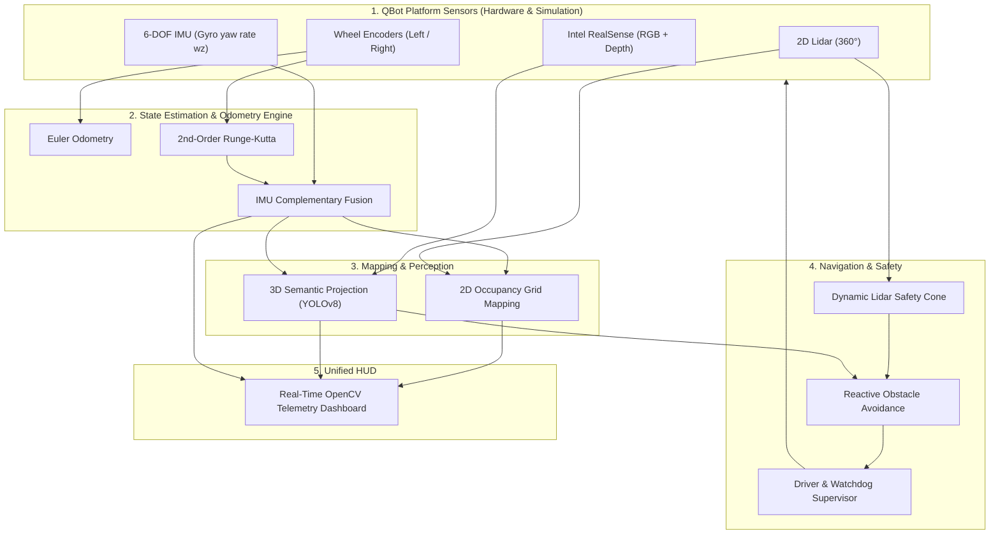

# 🤖 QBot Metric-Semantic AMR Autonomy Stack

[](https://python.org)
[](https://www.quanser.com)
[]()
[](LICENSE)

An industry-grade **Autonomous Mobile Robot (AMR)** pipeline built for the **Quanser QBot Platform**, fully integrated with both the **QLabs Digital Twin** and **Physical Lab Hardware**.

---

## 🚀 Key Capabilities

1. **High-Precision Odometry & State Estimation**
   - 2nd-Order Runge-Kutta (RK2 midpoint) numerical integration for differential drive kinematics.
   - Complementary sensor fusion combining wheel encoders with 6-DOF IMU gyroscope yaw rate ($\omega_z$).
2. **2D Occupancy Grid Mapping (Lidar SLAM)**
   - Log-odds inverse sensor model mapping with fast Bresenham raycasting from 360° 1680-point 2D Lidar scans.
3. **RGB-D 3D Semantic Perception**
   - Real-time object detection (YOLOv8) back-projected using camera pinhole intrinsics into metric world coordinates $(X, Y, Z)$.
4. **Dynamic Obstacle Avoidance & Safety Supervisor**
   - Speed-dependent dynamic frontal safety cone with automatic stop/slowdown zones and visual LED state alerts.
5. **Real-Time OpenCV HUD**
   - Integrated telemetry dashboard rendering camera feeds with 3D bounding boxes, live SLAM occupancy grid, and state estimations.

---

## 🏛️ System Architecture



---

## 📐 Mathematical Formulation

### Differential Drive Kinematics
Given wheel radius $r = 0.04445\text{ m}$ and track width (wheelbase) $L = 0.3928\text{ m}$:

$$\Delta s = \frac{\Delta s_R + \Delta s_L}{2}, \quad \Delta \theta_{\text{enc}} = \frac{\Delta s_R - \Delta s_L}{L}$$

### Runge-Kutta 2nd-Order (RK2 Midpoint Integration)
$$\theta_{\text{mid}} = \theta_k + \frac{\Delta \theta}{2}$$
$$x_{k+1} = x_k + \Delta s \cos(\theta_{\text{mid}}), \quad y_{k+1} = y_k + \Delta s \sin(\theta_{\text{mid}}), \quad \theta_{k+1} = \text{wrap}(\theta_k + \Delta \theta)$$

### Complementary Sensor Fusion
$$\Delta \theta_{\text{fused}} = \alpha \cdot \Delta \theta_{\text{enc}} + (1 - \alpha) \cdot (\omega_z \cdot \Delta t)$$

### 3D Pinhole Back-Projection
Given pixel $(u, v)$ and depth $Z = d(u, v)$ with camera intrinsics $(f_x, f_y, c_x, c_y)$:

$$X_c = \frac{(u - c_x) \cdot Z}{f_x}, \quad Y_c = \frac{(v - c_y) \cdot Z}{f_y}, \quad Z_c = Z$$

---

## 📁 Repository Structure

```text
├── PROJECT_SPEC.md              # Project specification, checklist & technical formulas
├── README.md                    # Project documentation & overview
├── .gitignore                   # Ignored files & build artifacts
├── odometry_engine.py           # Core odometry & sensor fusion algorithms
├── qbot_helpers.py              # Hardware wrappers, sensor dataclass & OpenCV HUD
├── qlabs_setup.py               # QLabs digital twin environment setup & spawning
├── test_odometry.py             # 1.0m x 1.0m benchmark test harness & plot generator
├── webots_version_connection.md # Webots simulation connectivity documentation
└── docs/
    └── figures/                 # Benchmark charts, plots & telemetry figures
```

---

## ⚡ Quick Start

### 1. Prerequisites & Installation
Ensure Python 3.8+ is installed:
```bash
pip install numpy matplotlib opencv-python ultralytics
```
*(Install Quanser QLabs / HIL SDK if interfacing with physical hardware or QLabs simulator).*

### 2. Launch QLabs Simulation Environment
```bash
python qlabs_setup.py
```

### 3. Run Odometry Benchmark Test
```bash
python test_odometry.py
```

---

## 📌 Project Roadmap
- [x] **Phase 1**: Odometry Engine (Euler, RK2 & Complementary IMU fusion)
- [ ] **Phase 2**: 2D Occupancy Grid SLAM (Log-odds raycasting)
- [ ] **Phase 3**: RGB-D 3D Semantic Perception (YOLOv8 + metric back-projection)
- [ ] **Phase 4**: Reactive Obstacle Avoidance & Safety Dynamic Cone
- [ ] **Phase 5**: Full Integration & Physical Lab Deployment
